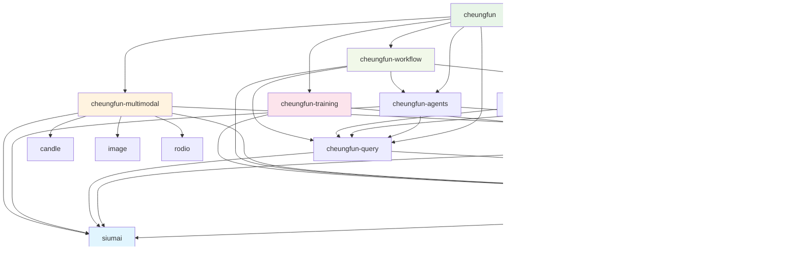

# Cheungfun - Rust版LlamaIndex设计文档

## 🎯 项目概述

Cheungfun是一个基于Rust的高性能RAG（检索增强生成）框架，参考LlamaIndex和Swiftide设计，提供类型安全的AI应用开发能力。

### 核心特色
- **🚀 高性能**: Rust原生 + Candle ML框架
- **🔧 模块化**: 清晰的模块划分，易于扩展
- **🌊 流式处理**: 支持大规模数据流式处理
- **🛡️ 类型安全**: 编译时错误检查
- **🔌 统一接口**: 通过siumai统一LLM访问
- **🤖 MCP集成**: 标准化工具调用协议

## 📦 模块架构

### 核心模块
- **cheungfun-core**: 基础trait、数据结构、错误处理
- **cheungfun-indexing**: 数据加载、文档处理、索引构建
- **cheungfun-query**: 查询引擎、检索器、响应生成
- **cheungfun-agents**: 智能代理、工具调用、MCP集成
- **cheungfun-integrations**: 向量数据库、外部服务集成

### 扩展模块
- **cheungfun-multimodal**: 图像、音频、视频处理 ✅ **开发中**
- **cheungfun-workflow**: 复杂工作流编排
- **cheungfun-training**: 模型微调和训练
- **cheungfun-evaluation**: 性能评估和指标

## 依赖关系图



## 🛠️ 技术栈

### 核心技术
- **Rust**: 系统编程语言，内存安全 + 高性能
- **Candle**: Rust原生ML框架，支持GPU加速
- **Siumai**: 统一LLM接口，支持多种AI提供商
- **Tokio**: 异步运行时，高并发处理
- **MCP (rmcp)**: 模型上下文协议，标准化工具调用

### 主要依赖
```toml
siumai = "0.3.0"                    # 统一LLM接口
candle-core = "0.9"                 # ML框架核心
candle-transformers = "0.9"         # Transformer模型
tokio = "1.45"                      # 异步运行时
qdrant-client = "1.14"              # 向量数据库
rmcp = "0.1"                        # MCP协议
```

## 🚀 快速开始

### 基本使用示例
```rust
use cheungfun::prelude::*;

#[tokio::main]
async fn main() -> Result<()> {
    // 1. 配置嵌入模型
    let embedder = CandleEmbedder::from_pretrained("sentence-transformers/all-MiniLM-L6-v2").await?;

    // 2. 构建索引
    let pipeline = IndexingPipeline::builder()
        .loader(FileLoader::new("./docs"))
        .transformer(TextSplitter::new(1000))
        .embedder(embedder.clone())
        .storage(QdrantStore::new("localhost:6334"))
        .build()?;

    pipeline.run().await?;

    // 3. 查询
    let query_engine = QueryEngine::builder()
        .retriever(VectorRetriever::new(storage, embedder))
        .llm_client(siumai::Siumai::builder().openai().build().await?)
        .build()?;

    let response = query_engine.query("What is the main topic?").await?;
    println!("Answer: {}", response.content);

    Ok(())
}
```

## 📋 开发路线图

### 第一阶段 (核心功能)
- [ ] cheungfun-core: 基础trait和数据结构
- [ ] cheungfun-indexing: 文件加载和文本处理
- [ ] cheungfun-query: 基础查询引擎
- [ ] Candle嵌入生成器
- [ ] 内存向量存储

### 第二阶段 (扩展功能)
- [ ] cheungfun-agents: MCP代理框架
- [ ] cheungfun-integrations: Qdrant集成
- [ ] 更多数据加载器
- [ ] 高级查询功能

### 第三阶段 (高级功能)
- [ ] 多模态支持
- [ ] 工作流引擎
- [ ] 模型训练
- [ ] 性能优化
