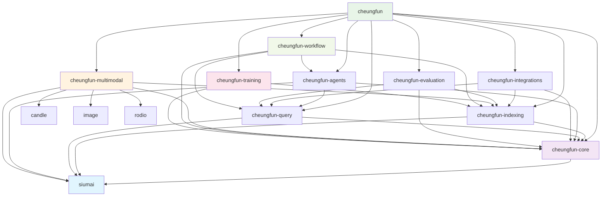

# Cheungfun - Rust版LlamaIndex设计文档

## 🎯 项目概述

Cheungfun是一个基于Rust的高性能RAG（检索增强生成）框架，参考LlamaIndex和Swiftide设计，提供类型安全的AI应用开发能力。

### 核心特色
- **🚀 高性能**: Rust原生 + Candle ML框架
- **🔧 模块化**: 清晰的模块划分，易于扩展
- **🌊 流式处理**: 支持大规模数据流式处理
- **🛡️ 类型安全**: 编译时错误检查
- **🔌 统一接口**: 通过siumai统一LLM访问
- **🤖 MCP集成**: 标准化工具调用协议

## 📦 模块架构

### 核心模块
- **cheungfun-core**: 基础trait、数据结构、错误处理
- **cheungfun-indexing**: 数据加载、文档处理、索引构建
- **cheungfun-query**: 查询引擎、检索器、响应生成
- **cheungfun-agents**: 智能代理、工具调用、MCP集成
- **cheungfun-integrations**: 向量数据库、外部服务集成

### 扩展模块
- **cheungfun-multimodal**: 图像、音频、视频处理 ✅ **开发中**
- **cheungfun-workflow**: 复杂工作流编排
- **cheungfun-training**: 模型微调和训练
- **cheungfun-evaluation**: 性能评估和指标

## 依赖关系图



## 🛠️ 技术栈

### 核心技术
- **Rust**: 系统编程语言，内存安全 + 高性能
- **Candle**: Rust原生ML框架，支持GPU加速
- **Siumai**: 统一LLM接口，支持多种AI提供商
- **Tokio**: 异步运行时，高并发处理
- **MCP (rmcp)**: 模型上下文协议，标准化工具调用

### 主要依赖
```toml
siumai = "0.3.0"                    # 统一LLM接口
candle-core = "0.9"                 # ML框架核心
candle-transformers = "0.9"         # Transformer模型
tokio = "1.45"                      # 异步运行时
qdrant-client = "1.14"              # 向量数据库
rmcp = "0.1"                        # MCP协议
```

## 🚀 快速开始

### 基本使用示例
```rust
use cheungfun::prelude::*;

#[tokio::main]
async fn main() -> Result<()> {
    // 1. 配置嵌入模型
    let embedder = CandleEmbedder::from_pretrained("sentence-transformers/all-MiniLM-L6-v2").await?;

    // 2. 构建索引
    let pipeline = IndexingPipeline::builder()
        .loader(FileLoader::new("./docs"))
        .transformer(TextSplitter::new(1000))
        .embedder(embedder.clone())
        .storage(QdrantStore::new("localhost:6334"))
        .build()?;

    pipeline.run().await?;

    // 3. 查询
    let query_engine = QueryEngine::builder()
        .retriever(VectorRetriever::new(storage, embedder))
        .llm_client(siumai::Siumai::builder().openai().build().await?)
        .build()?;

    let response = query_engine.query("What is the main topic?").await?;
    println!("Answer: {}", response.content);

    Ok(())
}
```

## � 增强文件过滤系统

### 核心特性
- **🎯 Gitignore 支持**: 自动识别和应用 `.gitignore` 规则
- **🌟 Glob 模式**: 支持复杂的 glob 模式匹配 (`*.rs`, `**/*.tmp`, `src/**`)
- **📏 文件大小过滤**: 基于文件大小的智能过滤
- **🔤 大小写控制**: 可配置的大小写敏感匹配
- **📁 隐藏文件处理**: 可选的隐藏文件排除
- **⚡ 高性能**: 使用 `ignore` 和 `globset` crate 优化性能

### 使用示例

```rust
use cheungfun_indexing::loaders::{DirectoryLoader, FilterConfig, LoaderConfig};

// 基础 gitignore 支持
let filter = FilterConfig::new()
    .with_respect_gitignore(true)
    .with_exclude_hidden(true);

let config = LoaderConfig::new().with_filter_config(filter);
let loader = DirectoryLoader::with_config("./src", config)?;

// 源代码专用过滤
let config = LoaderConfig::new().with_source_code_filtering();

// 自定义 glob 模式
let filter = FilterConfig::new()
    .with_exclude_patterns(vec!["target/**".to_string(), "*.log".to_string()])
    .with_include_patterns(vec!["src/**/*.rs".to_string()]);
```

### 预设配置
- `FilterConfig::source_code_only()`: 仅处理源代码文件
- `FilterConfig::text_files_only()`: 仅处理文本文件
- `LoaderConfig::with_enhanced_filtering()`: 启用默认增强过滤

## 🔍 代码索引系统

### 核心特性
- **🌳 AST解析**: 使用tree-sitter进行语法树解析
- **🔧 多语言支持**: 支持9+种主流编程语言
- **📊 智能提取**: 自动提取函数、类、导入、注释等代码结构
- **⚡ 代码感知分割**: 保持语法边界的智能文本分割
- **📈 复杂度分析**: 计算代码复杂度指标

### 支持的编程语言
- **Rust** - 完整支持函数、结构体、trait、模块
- **Python** - 函数、类、导入、装饰器
- **JavaScript/TypeScript** - 函数、类、模块、接口
- **Java** - 方法、类、接口、包导入
- **C#** - 方法、类、命名空间、using语句
- **C/C++** - 函数、结构体、类、预处理指令
- **Go** - 函数、结构体、接口、包导入

### 使用示例

```rust
use cheungfun_indexing::{CodeLoader, CodeLoaderConfig};

// 基础代码加载
let loader = CodeLoader::new("./src")?;
let documents = loader.load().await?;

// 高级配置
let config = CodeLoaderConfig {
    extract_functions: true,
    extract_classes: true,
    extract_imports: true,
    extract_comments: true,
    max_file_size: Some(5 * 1024 * 1024), // 5MB
    ..Default::default()
};

let loader = CodeLoader::with_config("./project", config)?;
```

## �📋 开发路线图

### 第一阶段 (核心功能)
- [ ] cheungfun-core: 基础trait和数据结构
- [x] cheungfun-indexing: 文件加载和文本处理 ✅ **增强文件过滤 + 代码索引已完成**
- [ ] cheungfun-query: 基础查询引擎
- [ ] Candle嵌入生成器
- [ ] 内存向量存储

### 第二阶段 (扩展功能)
- [ ] cheungfun-agents: MCP代理框架
- [ ] cheungfun-integrations: Qdrant集成
- [ ] 更多数据加载器
- [ ] 高级查询功能

### 第三阶段 (高级功能)
- [ ] 多模态支持
- [ ] 工作流引擎
- [ ] 模型训练
- [ ] 性能优化
